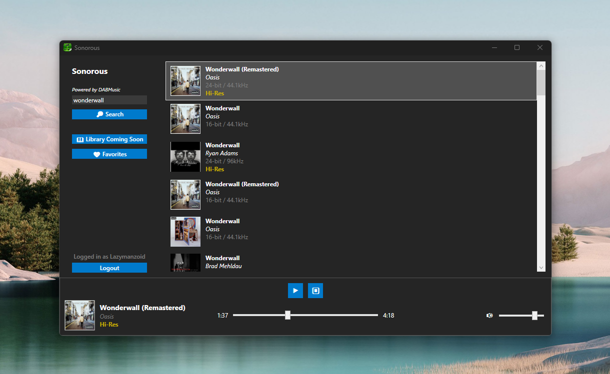

<!-- Improved compatibility of back to top link: See: https://github.com/othneildrew/Best-README-Template/pull/73 -->
<a id="readme-top"></a>
<!--
*** Thanks for checking out the Best-README-Template. If you have a suggestion
*** that would make this better, please fork the repo and create a pull request
*** or simply open an issue with the tag "enhancement".
*** Don't forget to give the project a star!
*** Thanks again! Now go create something AMAZING! :D
-->


<!-- PROJECT SHIELDS -->
<!--
*** I'm using markdown "reference style" links for readability.
*** Reference links are enclosed in brackets [ ] instead of parentheses ( ).
*** See the bottom of this document for the declaration of the reference variables
*** for contributors-url, forks-url, etc. This is an optional, concise syntax you may use.
*** https://www.markdownguide.org/basic-syntax/#reference-style-links
-->
[![Contributors][contributors-shield]][contributors-url]
[![Forks][forks-shield]][forks-url]
[![Stargazers][stars-shield]][stars-url]
[![Issues][issues-shield]][issues-url]
[![AGPLv3][license-shield]][license-url]


<!-- PROJECT LOGO -->
<br />
<div align="center">
  <a href="https://github.com/LazymanzoidOfficial/Sonorous">
    
  </a>

<h3 align="center">Sonorous</h3>

  <p align="center">
   A free, open-source DAB music client made in WPF.
    <br />
    <a href="https://github.com/LazymanzoidOfficial/Sonorous"><strong>Explore the docs »</strong></a>
    <br />
    <br />
    <a href="https://github.com/LazymanzoidOfficial/Sonorous/issues/new?labels=bug&template=bug-report---.md">Report Bug</a>
    &middot;
    <a href="https://github.com/LazymanzoidOfficial/Sonorous/issues/new?labels=enhancement&template=feature-request---.md">Request Feature</a>
  </p>
</div>


<!-- TABLE OF CONTENTS -->
<details>
  <summary>Table of Contents</summary>
  <ol>
    <li>
      <a href="#about-the-project">About The Project</a>
        </li>
    <li>
      <a href="#getting-started">Getting Started</a>
      <ul>
        <li><a href="#prerequisites">Prerequisites</a></li>
        <li><a href="#installation">Installation</a></li>
      </ul>
    </li>
     <li><a href="#roadmap">Roadmap</a></li>
    <li><a href="#contributing">Contributing</a></li>
    <li><a href="#license">License</a></li>
    <li><a href="#contact">Contact</a></li>
  </ol>
</details>


<!-- ABOUT THE PROJECT -->
## About The Project



Sonorous is a free, open-source music app built in WPF and utilizes the DAB Music API for music searching, playback, and login.

<p align="right">(<a href="#readme-top">back to top</a>)</p>


# Features
- **🎵 Hi-Res Lossless Audio**: Listen to your favorite songs in the highest sound quality available. (Up to 24-bit/192khz)
- **🖥️ No Electron**: That's right! No electron is used, or any other chrome framework that eats up your RAM. The app is built on WPF, a lightweight and fast framework.
- **👤 Account System**: Sonorous allows you to log into your DAB Music account and access your favorite tracks. (Library coming soon).
- **🗒️ Open Source**: Sonorous is completely open-source, allowing you to look inside the code of the app and make contributions.

<p align="right">(<a href="#readme-top">back to top</a>)</p>


<!-- GETTING STARTED -->
## Getting Started

### Prerequisites

* Visual Studio 2022
* .NET 8.0
* Git for Windows (if you want to contribute)

### Installation

### 1. Clone the repo
   ```sh
   git clone https://github.com/LazymanzoidOfficial/Sonorous.git
   cd Sonorous
   ```
### 2. Open the project
   - **Method A:** Open the ```.sln``` file in the folder
   - **Method B:** In Visual Studio, go to File > Open > Project/Solution, then navigate to the cloned folder and open the ```.sln``` file.

### 3. Fix NuGet Packages
- Visual Studio 2022 might prompt you to fix them. If the pop-up does not appear,
- Go to Tools > NuGet Package Manager > Package Manager Console and run this command:
```Update-Package -reinstall```

### 4. Build the project
- Press **Ctrl + Shift + B** to build the project.
- Then press F5 to run the project.

<!-- ROADMAP -->
## Roadmap

- [ ] Library system
- [ ] Song queue
- [ ] Account creation

See the [open issues](https://github.com/LazymanzoidOfficial/Sonorous/issues) for a full list of proposed features (and known issues).

<p align="right">(<a href="#readme-top">back to top</a>)</p>


<!-- CONTRIBUTING -->
## Contributing

Contributions are what make the open source community such an amazing place to learn, inspire, and create. Any contributions you make are **greatly appreciated**.

If you have a suggestion that would make this better, please fork the repo and create a pull request. You can also simply open an issue with the tag "enhancement".
Don't forget to give the project a star! Thanks again!

1. Fork the Project
2. Create your Feature Branch (`git checkout -b feature/AmazingFeature`)
3. Commit your Changes (`git commit -m 'Add some AmazingFeature'`)
4. Push to the Branch (`git push origin feature/AmazingFeature`)
5. Open a Pull Request

<p align="right">(<a href="#readme-top">back to top</a>)</p>


<!-- LICENSE -->
## License

Distributed under the AGPLv3 license. See `LICENSE.txt` for more information.

<p align="right">(<a href="#readme-top">back to top</a>)</p>


<!-- CONTACT -->
## Contact

[@Lazymanzoid](https://twitter.com/Lazymanzoid) - lazymanzoid@outlook.com

[https://github.com/LazymanzoidOfficial/Sonorous](https://github.com/LazymanzoidOfficial/Sonorous)

<p align="right">(<a href="#readme-top">back to top</a>)</p>


<!-- MARKDOWN LINKS & IMAGES -->
<!-- https://www.markdownguide.org/basic-syntax/#reference-style-links -->
[contributors-shield]: https://img.shields.io/github/contributors/LazymanzoidOfficial/Sonorous.svg?style=for-the-badge
[contributors-url]: https://github.com/LazymanzoidOfficial/Sonorous/graphs/contributors
[forks-shield]: https://img.shields.io/github/forks/LazymanzoidOfficial/Sonorous.svg?style=for-the-badge
[forks-url]: https://github.com/LazymanzoidOfficial/Sonorous/network/members
[stars-shield]: https://img.shields.io/github/stars/LazymanzoidOfficial/Sonorous.svg?style=for-the-badge
[stars-url]: https://github.com/LazymanzoidOfficial/Sonorous/stargazers
[issues-shield]: https://img.shields.io/github/issues/LazymanzoidOfficial/Sonorous.svg?style=for-the-badge
[issues-url]: https://github.com/LazymanzoidOfficial/Sonorous/issues
[license-shield]: https://img.shields.io/github/license/LazymanzoidOfficial/Sonorous.svg?style=for-the-badge
[license-url]: https://github.com/LazymanzoidOfficial/Sonorous/blob/master/LICENSE.txt
[product-screenshot]: screenshots/product.png
